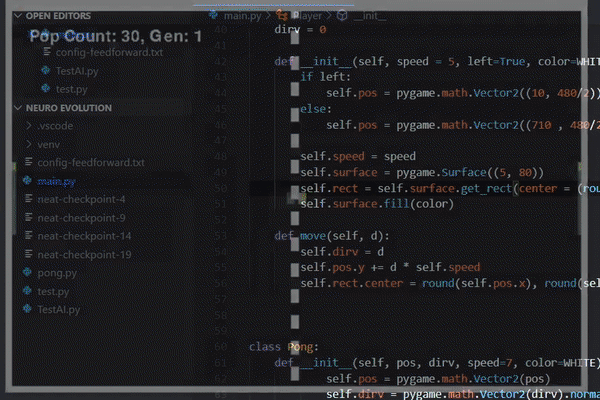

# Pong AI

A neat-python implementation on the simple pong game



*Training simulation on a population of 50 for 2 generations*

## Requirements

``` 
pip install neat-python
pip install pygame
```

## How it works

For a detailed concept read the [paper](http://nn.cs.utexas.edu/downloads/papers/stanley.ec02.pdf)

In my approach there is a `Player` class which represents either a player and the right or on the left.
For each genome in the main evaluation loop there are lists of same length containing a complete gamestate. 
If a genome does well in it's gamestate (in this case if it pongs the ball), it's fitness increases.
The NN is given the y-position of the player and the y-position of the ball and outputs a sigmoid activation, 
which then decides wether the player should move up, down or stay where it is.


